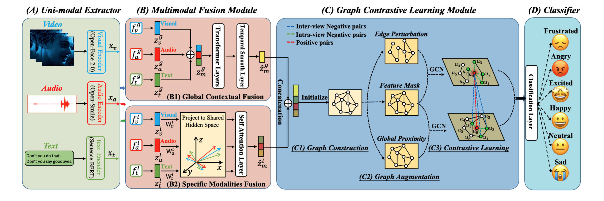

# Joyful
This is the official implementation for the paper "Joyful: Joint Modality Fusion and Graph Contrastive Learning for Multimodal Emotion Recognition" accepted by EMNLP2023.

# Structure of Joyful


## Table of Contents

- [Dependencies](#security)
- [Requirement](#background)
- [Install](#install)
- [Dataset](#dataset)
- [Usage](#usage)
- [Maintainers](#maintainers)
- [Contributing](#contributing)
- [License](#license)

## Dependencies

- Python 3.9.1
- PyTorch toolbox (1.12.1+cu113)
- Linux 5.11.0-46-generic

The version of CUDA is very important, please use the same CUDA version for training. 
For fast check, the check point is provided.

## Requirement
- We use PyG (PyTorch Geometric) for the GNN component in our architecture. [RGCNConv](https://pytorch-geometric.readthedocs.io/en/latest/modules/nn.html#torch_geometric.nn.conv.RGCNConv) and [TransformerConv](https://pytorch-geometric.readthedocs.io/en/latest/modules/nn.html#torch_geometric.nn.conv.TransformerConv)
- We use PyGCL for GCL (Graph Contrastive Learning) network in out framework. [PyGCL](https://github.com/PyGCL/PyGCL)
- We use sentence transfomer for text feature extraction. [Sentence Embedding](https://huggingface.co/sentence-transformers/paraphrase-distilroberta-base-v1)


## Install
To easily reproduce our results, you can install the environments by
```
pip install -r requirements.txt
```


## Dataset

The IEMOCAP 4 classification dataset is store in
```
./data/iemocap_4/data_iemocap_4.pkl
```

The IEMOCAP 6 classification dataset is store in
```
./data/iemocap/data_iemocap.pkl
```

The Mosei dataset is avaliable on this official website
[Mosei](http://multicomp.cs.cmu.edu/resources/cmu-mosei-dataset/) 


## Usage

### Train the model

```
python train.py --dataset="iemocap_4" --modalities="atv" --from_begin --epochs=50
```

### Evaluate the model

```
python eval.py --dataset="iemocap_4" --modalities="atv"
```

### Train the model use single modality (text)

```
python eval.py --dataset="iemocap_4" --modalities="t"
```


